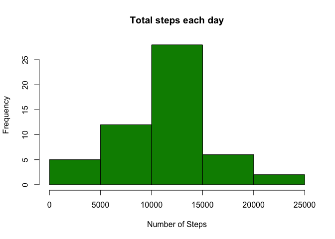

Loading and preprocessing the data
----------------------------------

Download and load data into data frame "data"

    if(!file.exists("activity.csv")) {
            temp <- tempfile()
            download.file("https://d396qusza40orc.cloudfront.net/repdata%2Fdata%2Factivity.zip",temp)
            unzip(temp)
            unlink(temp)
    }
    data <- read.csv("activity.csv")

What is mean total number of steps taken per day?
-------------------------------------------------

Sum steps by day, create histogram.

    stepsByDay <- aggregate(steps ~ date, data, sum)
    hist(stepsByDay$steps, main = "Total steps each day", col="green4", xlab="Number of Steps")

Calculate mean and median.

    stepsMean <- mean(stepsByDay$steps)
    stepsMedian <- median(stepsByDay$steps)

The mean is 1.076610^{4} The median is 1.076510^{4}

What is the average daily activity pattern?
-------------------------------------------

Calculate average steps for each interval for all days and plot the
average number of steps per day by interval.

    stepsByInterval <- aggregate(steps ~ interval, data, mean)
    plot(stepsByInterval$interval,stepsByInterval$steps, type="l", xlab="Interval", ylab="Number of steps",main="Average number of steps per day by interval")

Find interval with most average steps.

    maxInterval <- stepsByInterval[which.max(stepsByInterval$steps),1]

The 5-minute interval, on average across all the days in the data set,
containing the maximum number of steps is 835

Imputing missing values
-----------------------

Missing data needed to be imputed. Missing values were imputed by
inserting the average for each interval.

    incomplete <- sum(!complete.cases(data))
    imputedData <- transform(data, steps = ifelse(is.na(data$steps), stepsByInterval$steps[match(data$interval, stepsByInterval$interval)], data$steps))
    imputedData[as.character(imputedData$date) == "2012-10-01", 1] <- 0

NAs for 10-01-2012 were assumed to be zeros to fit the rising trend of
the data.

Recount total steps by day and create histogram.

    stepsByDay2 <- aggregate(steps ~ date, imputedData, sum)
    hist(stepsByDay2$steps, main = "Total steps each day", col="cyan", xlab="Number of steps")
    hist(stepsByDay$steps, main = "Total steps each day", col="green4", xlab="Number of steps", add=TRUE)
    legend("topright", c("Imputed", "Non-imputed"), col=c("cyan", "green"), lwd=10)

Calculate new mean and median for imputed data.

    stepsMean2 <- mean(stepsByDay2$steps)
    stepsMedian2 <- median(stepsByDay2$steps)

Calculate difference between imputed and non-imputed data.

    meanDiff <- stepsMean2 - stepsMean
    medianDiff <- stepsMedian2 - stepsMedian

Calculate total difference.

    totalDiff <- sum(stepsByDay2$steps) - sum(stepsByDay$steps)

The imputed data mean is 1.05910^{4}

The imputed data median is 1.076610^{4}

The difference between the non-imputed mean and imputed mean is
-176.4948964

The difference between the non-imputed median and imputed median is
1.1886792

The difference between total number of steps between imputed and
non-imputed data is 7.536310^{4}.

Are there differences in activity patterns between weekdays and weekends?
-------------------------------------------------------------------------

Create a plot to compare number of steps between the week and weekend.

    weekdays <- c("Monday", "Tuesday", "Wednesday", "Thursday", "Friday")
    imputedData$dow = as.factor(ifelse(is.element(weekdays(as.Date(imputedData$date)),weekdays), "Weekday", "Weekend"))

    stepsByInterval2 <- aggregate(steps ~ interval + dow, imputedData, mean)

    library(lattice)

    xyplot(stepsByInterval2$steps ~ stepsByInterval2$interval|stepsByInterval2$dow, main="Average steps per day by interval",xlab="Interval", ylab="Steps",layout=c(1,2), type="l")

